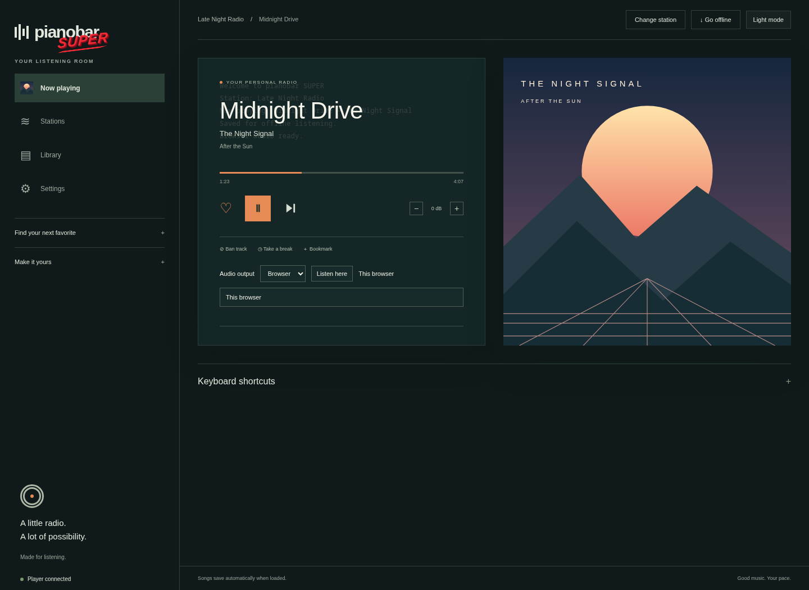
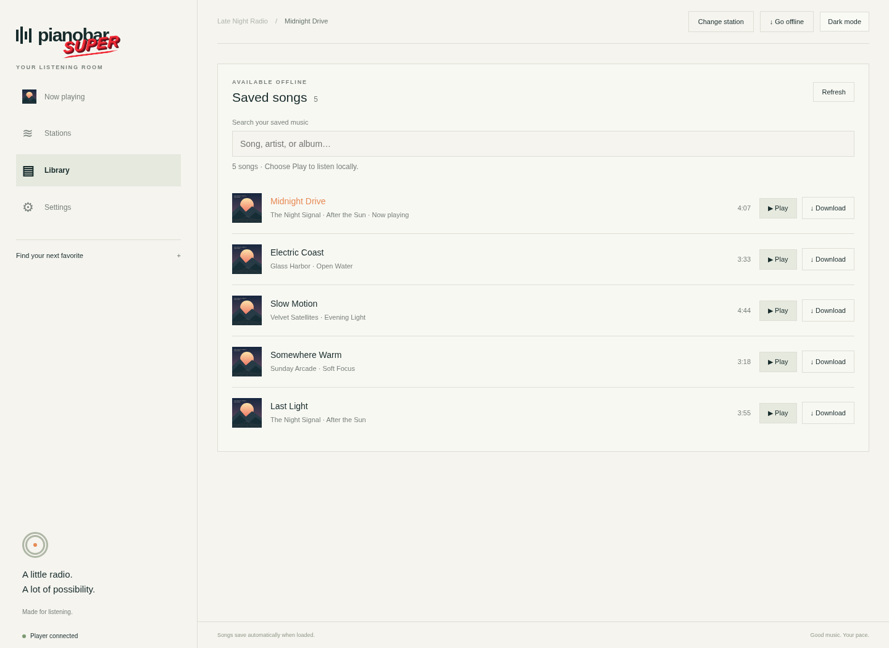
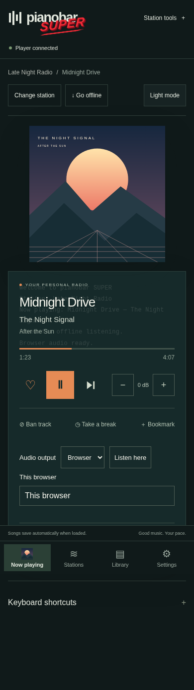

# pianobar SUPER

Your Pandora stations, a browser player, and a growing offline music library—on
your own server. Control it from a desktop, phone, or terminal.



- Play and manage stations, rate songs, and use the familiar pianobar hotkeys.
- Save songs automatically when they load; skipping does not cancel the save.
- Browse saved music with cached album art, play offline, or download M4A/MP3 files.
- Listen through browsers, host speakers, or both. Each browser can join independently.
- Dark/light themes, mobile navigation, settings, and a collapsible shortcut legend.
- Android companion with a configurable server and on-device offline library.

## Install on Proxmox

Run in the **Proxmox host's root shell**:

```sh
curl -fsSL https://raw.githubusercontent.com/Bake-Ware/pianobar-super/main/scripts/proxmox-lxc.sh -o /tmp/pianobar-lxc.sh
bash /tmp/pianobar-lxc.sh
```

Enter your **Pandora email and password**, then a separate **web login password**.
Password entry is hidden. The remaining installation is unattended: it downloads
a Debian 12 template, creates an unprivileged LXC, builds the app, enables its
service, and prints the web address. Sign in as **pianobar**, then select a station.

Defaults: **2 cores, 2GB RAM, 100GB disk**, DHCP on `vmbr0`, root disk on
`local-lvm`, templates on `local`, and the next unused container ID. A 100GB disk
leaves room for several thousand tracks; actual capacity depends on duration and
quality. Music is never automatically evicted, so monitor disk usage.

Customize without editing the script:

```sh
STORAGE=local-lvm BRIDGE=vmbr0 DISK_GB=150 CT_ID=250 bash /tmp/pianobar-lxc.sh
```

Also available: `TEMPLATE_STORAGE`, `MEMORY_MB`, `CORES`, and `CT_HOSTNAME`.
The script refuses an occupied ID. If installation fails after creation, it removes
only the new container belonging to that run. It does not modify Proxmox repositories
or existing containers. A working DHCP server, DNS, Internet access, and suitable
storage are required. See [deployment details](deployment/README.md).

## Install on a Debian server

On **Debian 12**, run as root (or use `sudo bash /tmp/pianobar-install.sh`):

```sh
curl -fsSL https://raw.githubusercontent.com/Bake-Ware/pianobar-super/main/install.sh -o /tmp/pianobar-install.sh
bash /tmp/pianobar-install.sh
```

The same credential prompts configure a system service. The installer handles
dependencies, compilation, and startup. Run it again to update while retaining
your configuration and saved songs. Updates restart playback. Debian 12 is
intentional: the native player currently targets FFmpeg 5.

Both scripts can use a local checkout with `--source /path/to/pianobar-super`.
For fully unattended provisioning, supply `--credentials-file /private/credentials.json`.
That file must have mode `0600` and exactly these JSON string fields: `user`,
`password`, and `web_password`. The web password must be at least 12 characters.
Use your secret manager to create it outside the checkout. The installer removes
its temporary copies; you remain responsible for deleting the original input file.
Never pass passwords on the command line or commit them.

## Listen

Open `http://<server-ip>:8765/`. **Listen here** joins this browser; a click may
be needed because of browser autoplay rules. Disable automatic listening in
**Settings → This browser** to use a page as a remote control instead.

Station selection and transport controls affect the shared player. Stopping
listening in one browser leaves other listeners playing. Browsers play concurrently,
but are **not synchronized across rooms**. Browser audio is compressed PCM and
can use up to roughly 1.4Mbps per listener before compression at 44.1kHz stereo.

The installer enables password-protected LAN access. HTTP is intended for a trusted
network; use an authenticated HTTPS reverse proxy for Internet access. No public
domain, tunnel, or external login provider is bundled or provisioned.

## Saved music



Tracks download in the background as they load, independently of playback. Wait
for the **Saving … songs for offline** message to clear before shutting down.
Only completed saves appear in Library; identical song/quality entries are
deduplicated. Saving uses an additional download request, so it consumes extra bandwidth.

Choose **Go offline** to play saved songs. Network failures can also trigger offline
fallback when saved music is available. **Reconnect** returns to Pandora.
Library's **Download** button exports AAC as M4A or MP3 as MP3, with metadata and
available artwork, without re-encoding. Server saves live under
`/var/lib/pianobar/songs` for installer-managed deployments.

## Android and mobile



The [Android release](https://github.com/Bake-Ware/pianobar-super/releases) is also
linked from the web app's **Settings → Android app**. Android 8.0 or later is required.
Enter your own server address in the app's Settings; it ships without one.

The app uses native background audio with lock-screen controls. Sign in inside
Player, select a station, then tap **Listen**. Its login session is separate from
your installed browser; see the Android README for proxy login limitations.
For offline device playback, download songs from the web Library, then use
**Downloads → Add downloaded tracks** in the APK to import them. These local copies
play without the server, including with the screen off.
See [Android setup, builds, and package migration](android/README.md).

## Terminal and development

For a local build, install the dependencies listed in [install.sh](install.sh), then:

```sh
make
./pianobar             # Web interface enabled by default
./pianobar --cli       # Terminal only
./pianobar --offline   # Play the local library
make install-user     # Install the command in ~/.local/bin
make test
```

Ensure `~/.local/bin` is on your `PATH`; no alias is needed. The terminal help lists
your configured keys, including the browser-opening shortcut. Further configuration
is documented in the [manual](contrib/pianobar.1) and [example config](contrib/config-example).
The [REST API and optional Rook integration](integrations/README.md) expose controls
and browser routing for automation.
See the [installer validation report](docs/validation.md) for tested paths and privacy-review scope.

Screenshots above use fictional music and original generated vector artwork, with
the actual web UI. To reproduce them in an isolated Python environment:

```sh
pip install playwright
python -m playwright install chromium --only-shell
python scripts/screenshots.py
```

## Credits

Based on [pianobar](https://codeberg.org/purplesym/pianobar), created by
**Lars-Dominik Braun** and maintained by the upstream contributors. This fork adds
the web interface, local caching/offline playback, browser streaming, installers,
and Android companion. The original copyright notices and [MIT license](COPYING)
are preserved. Pandora and Android belong to their respective owners; this project
is independent and is not endorsed by them.
