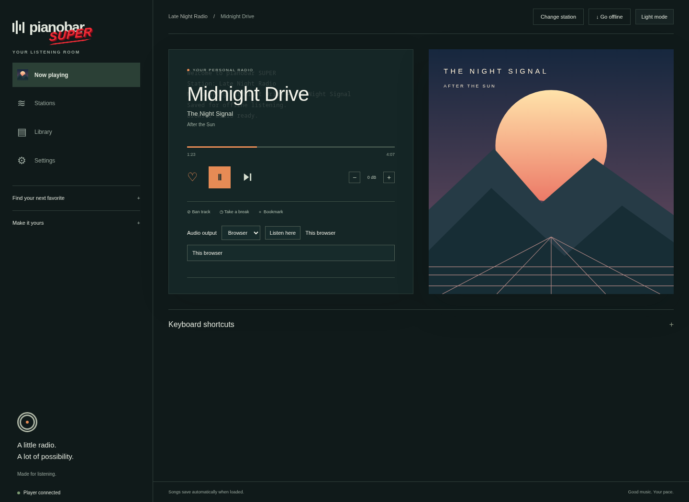
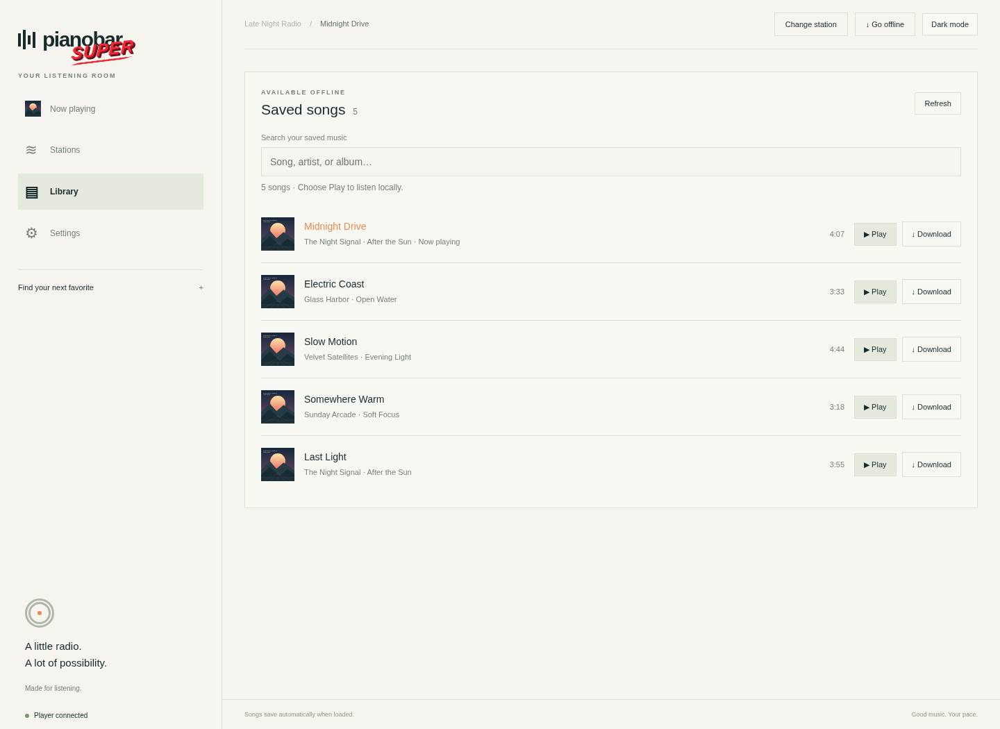
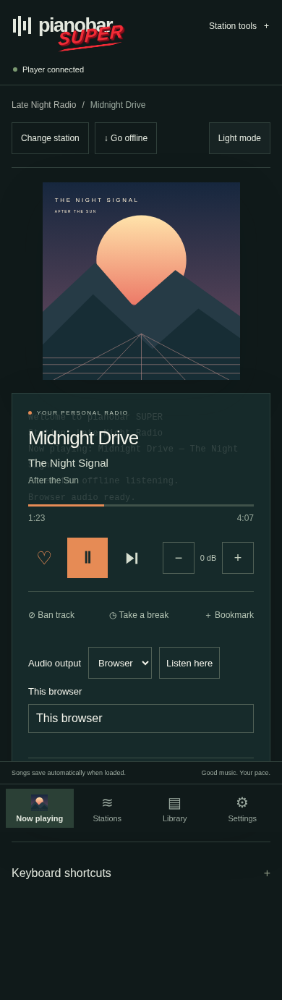

# pianobar SUPER

Your Pandora stations, a browser player, and a growing offline music library—on
your own server. Control it from a desktop, phone, or terminal.



- Play and manage stations, rate songs, and use the familiar pianobar hotkeys.
- Save songs automatically when they load; skipping does not cancel the save.
- Browse saved music with cached album art, play offline, or download M4A/MP3 files.
- Listen through browsers, host speakers, or both. Each browser can join independently.
- Dark/light themes, mobile navigation, settings, and a collapsible shortcut legend.
- Android companion with a configurable server and on-device offline library.

## Install on Proxmox

Run in the **Proxmox host's root shell**:

```sh
curl -fsSL https://raw.githubusercontent.com/Bake-Ware/pianobar-super/main/scripts/proxmox-lxc.sh -o /tmp/pianobar-lxc.sh
bash /tmp/pianobar-lxc.sh
```

Enter your **Pandora email and password**, then a separate **web login password**.
Password entry is hidden. The remaining installation is unattended: it downloads
a Debian 12 template, creates an unprivileged LXC, builds the app, enables its
service, and prints the web address. Sign in as **pianobar**, then select a station.

Defaults: **2 cores, 2GB RAM, 100GB disk**, DHCP on `vmbr0`, root disk on
`local-lvm`, templates on `local`, and the next unused container ID. A 100GB disk
leaves room for several thousand tracks; actual capacity depends on duration and
quality. Music is never automatically evicted, so monitor disk usage.

Customize without editing the script:

```sh
STORAGE=local-lvm BRIDGE=vmbr0 DISK_GB=150 CT_ID=250 bash /tmp/pianobar-lxc.sh
```

Also available: `TEMPLATE_STORAGE`, `MEMORY_MB`, `CORES`, and `CT_HOSTNAME`.
The script refuses an occupied ID. If installation fails after creation, it removes
only the new container belonging to that run. It does not modify Proxmox repositories
or existing containers. A working DHCP server, DNS, Internet access, and suitable
storage are required. See [deployment details](deployment/README.md).

## Install on a Debian server

On **Debian 12**, run as root (or use `sudo bash /tmp/pianobar-install.sh`):

```sh
curl -fsSL https://raw.githubusercontent.com/Bake-Ware/pianobar-super/main/install.sh -o /tmp/pianobar-install.sh
bash /tmp/pianobar-install.sh
```

The same credential prompts configure a system service. The installer handles
dependencies, compilation, and startup. Run it again to update while retaining
your configuration and saved songs. Updates restart playback. Debian 12 is
intentional: the native player currently targets FFmpeg 5.

Both scripts can use a local checkout with `--source /path/to/pianobar-super`.
For fully unattended provisioning, supply `--credentials-file /private/credentials.json`.
That file must have mode `0600` and exactly these JSON string fields: `user`,
`password`, and `web_password`. The web password must be at least 12 characters.
Use your secret manager to create it outside the checkout. The installer removes
its temporary copies; you remain responsible for deleting the original input file.
Never pass passwords on the command line or commit them.

## Listen

Open `http://<server-ip>:8765/`. **Listen here** joins this browser; a click may
be needed because of browser autoplay rules. Disable automatic listening in
**Settings → This browser** to use a page as a remote control instead.

Station selection and transport controls affect the shared player. Stopping
listening in one browser leaves other listeners playing. Browsers play concurrently,
but are **not synchronized across rooms**. Browser audio is compressed PCM and
can use up to roughly 1.4Mbps per listener before compression at 44.1kHz stereo.

The installer enables password-protected LAN access. HTTP is intended for a trusted
network; use an authenticated HTTPS reverse proxy for Internet access. No public
domain, tunnel, or external login provider is bundled or provisioned.

## Saved music



Tracks download in the background as they load, independently of playback. Wait
for the **Saving … songs for offline** message to clear before shutting down.
Only completed saves appear in Library; identical song/quality entries are
deduplicated. Saving uses an additional download request, so it consumes extra bandwidth.

Choose **Go offline** to play saved songs. Network failures can also trigger offline
fallback when saved music is available. **Reconnect** returns to Pandora.
Library's **Download** button exports AAC as M4A or MP3 as MP3, with metadata and
available artwork, without re-encoding. Server saves live under
`/var/lib/pianobar/songs` for installer-managed deployments.

## Song metadata and artwork

The web player enriches the current song using MusicBrainz and Cover Art Archive,
without API keys. Lookups run in the background and cache genres, release dates,
and recovered artwork under the library folder. Artist genres are labeled when
track genres are unavailable. Matches require the same artist and title; artwork
uses the named album when one is supplied. Coverage varies by release.

Artwork falls back from the local cache to Pandora and then Cover Art Archive.
Cached metadata and artwork remain available without a connection. Cached-song
playback can still fetch missing metadata when internet access is available; set
`PIANOBAR_METADATA_NETWORK=0` to disable those external lookups. Successful metadata is
refreshed after 30 days; missing matches after a day; service errors after five
minutes. MusicBrainz requests are limited to one per 1.1 seconds.

**Find on YouTube** opens a search for the current artist and song. YouTube is
only contacted when you click the link; the player does not embed videos.

## LLM DJ and voice endpoint

The **DJ booth** sits in the Now playing controls, under the track actions. It
appears once an LLM or a voice is configured, and each switch only appears
when what it needs is set up. (The remaining pianobar commands moved to
**More controls** in the sidebar.)

- **Talks**: the DJ introduces each new song once it has settled (about three
  seconds in), and reads any line you type into **Give the DJ a line**.
  **Introduce this song** asks for an introduction on demand; **Stop** cuts the
  current line.
- **Hops stations**: every few songs (Settings → **Songs per station when
  hopping**, default 4), the DJ queues a random Pandora station. The current
  song finishes first, every station is visited before any repeats, and
  QuickMix is skipped. When Talks is on, the first intro on the new station
  mentions the switch. Changing station yourself restarts the count.
- **Picks music**: the server chooses validated tracks from your saved
  library around the **Station theme**, queues the next set while the current
  song finishes, and prepares one spoken summary for the start of each set. The
  booth lists the current and upcoming set. Recent tracks are excluded when
  alternatives exist, and large libraries use a rotating sample of 100
  candidates per selection. A failed LLM response leaves cached playback running.

The server does all of the DJ work. It writes the introduction, synthesizes the
voice and hands the clip to the player, which mixes it into its own output. The
DJ is therefore heard on Host speakers and in every listening browser at the
same moment, with no browser needing to stay open. By default the music dips to
a quarter, the DJ speaks, and the music returns. Uncheck **Talk over the music**
in Settings to hold the music while the DJ speaks instead; the song then picks
up from where it stopped. Pausing pauses the voice with the music; skipping,
changing station or going online drops a line about the old song.

The DJ only writes and picks music while someone can hear it: the player is not
paused, and the output includes Host, or a browser is listening. **Talks** is
remembered across restarts. The station picker starts off when the server
starts, and reconnecting to Pandora stops it. Hopping only runs online and is
remembered across restarts. Set **DJ name** and **Your name** to
personalize introductions. In Settings, size DJ sets by **Number of songs**
(1–30) or **Minutes of music** (1–120); timed sets aim for the target using whole
songs. Names, personality, theme, voice and set sizing apply on save without a
restart.

Use **Settings → LLM DJ & voice** to edit endpoints, model, keys, voice,
certificate path, default theme/personality and metadata fetching. The voice
dropdown loads the active voice server’s `/voices` catalog and preserves your
selection if that server is unavailable. **Sample voice** previews the selected
voice in this browser before saving, even when music is stopped. **Save settings**
applies it immediately without restarting the player or server. Blank key
fields preserve saved keys; explicit Forget options clear them. Use **Save &
restart player** to apply other provider changes. Environment overrides are labeled and their
fields are disabled in the editor.

Alternatively, set these environment variables before starting the server, or put the
corresponding fields in private `$XDG_CONFIG_HOME/pianobar/dj.json` (default
`~/.config/pianobar/dj.json`). Environment variables take precedence. JSON fields
are `llm_url`, `model`, `llm_key`, `style`, `tts_url`, `voice`, `tts_key`, optional `tts_ca`,
`talk`, `hop` and `hop_songs`.

| Variable | Purpose |
| --- | --- |
| `PIANOBAR_DJ_URL` | Full HTTP chat endpoint, such as a local Ollama `/api/chat` URL |
| `PIANOBAR_DJ_MODEL` | Model available at that endpoint |
| `PIANOBAR_DJ_KEY` | Optional bearer token, kept on the server |
| `PIANOBAR_DJ_STYLE` | Default personality for API callers |
| `PIANOBAR_TTS_URL` | Optional HTTP voice endpoint |
| `PIANOBAR_TTS_VOICE` | Voice name sent to the voice endpoint or local engine |
| `PIANOBAR_TTS_KEY` | Optional voice endpoint bearer token |
| `PIANOBAR_TTS_CA` | Optional certificate file for a private HTTPS voice endpoint |

The chat adapter sends `{model, messages, stream: false}` and accepts text from
`message.content` or `choices[0].message.content`. This supports the
[Ollama chat API](https://docs.ollama.com/api/chat). Use a model already installed
on your provider. URLs and tokens are never included in public settings.

The voice adapter sends `{text, voice}` and expects WAV, MP3, or Ogg audio in the
HTTP response with the matching audio content type. Without a configured voice
URL, the server uses `espeak-ng` or `espeak` when installed. If neither is
available, the booth asks you to configure a voice and **Talks** stays off.

`integrations/voice-tts.py` adds an authenticated `/api/voice` route to an
existing FastAPI voice service through `install(app, authorize)`. It uses the
service's loaded speech provider and key store, returns WAV audio, bounds text
and request sizes, and admits one synthesis at a time. A private HTTPS
certificate can be supplied through `PIANOBAR_TTS_CA`; TLS verification remains
active.

An external agent can read song context, steer the DJ and give it lines to say:

| Endpoint | Behavior |
| --- | --- |
| `GET /api/dj` | Current song, metadata, provider readiness, and `songKey` |
| `POST /api/dj` | Generate `{text, songKey}`; optional `{style}` request |
| `POST /api/dj/control` | Any of `{enabled, talk, hop, stopVoice, theme, style}`: start/stop the station picker, turn the voice or station hopping on/off, cut the current line, or change the theme or personality |
| `POST /api/dj/pick` | `{play?, theme?, style?}` selects one cached song; queues by default, `play: true` plays immediately |
| `POST /api/dj/introduce` | Write and speak an introduction for the current song in the background; optional `{style}` |
| `POST /api/dj/announce` | Speak `{text, songKey?}` through the player on every output, even when **Talks** is off |
| `POST /api/voice` | Convert `{text, voice?}` to audio, without broadcasting it |

For example, with the server running locally:

```sh
curl -H 'Content-Type: application/json' \
  -d '{"text":"Coming at ya with some London punk!"}' \
  http://localhost:8765/api/dj/announce

curl -H 'Content-Type: application/json' \
  -d '{"text":"Coming at ya with some London punk!"}' \
  http://localhost:8765/api/voice --output dj.wav
```

Include `songKey` from `GET /api/dj` when an introduction belongs to a specific
song, so an outdated announcement is rejected after a track change. The
`djVoice` field of `GET /api/state` reports each line as `writing`, `preparing`,
`on_air`, `done`, `idle` or `error`. The existing
web authentication and origin checks apply to DJ and voice endpoints. Text is
limited to 700 characters. Generation and voice requests have bounded concurrency
and timeouts; repeated introductions for the same song and personality reuse the
session cache.

## Android and mobile



The [Android release](https://github.com/Bake-Ware/pianobar-super/releases) is also
linked from the web app's **Settings → Android app**. Android 8.0 or later is required.
Enter your own server address in the app's Settings; it ships without one.

The app uses native background audio with lock-screen controls. Sign in inside
Player, select a station, then tap **Listen**. Its login session is separate from
your installed browser; see the Android README for proxy login limitations.
For offline device playback, download songs from the web Library, then use
**Downloads → Add downloaded tracks** in the APK to import them. These local copies
play without the server, including with the screen off.
See [Android setup, builds, and package migration](android/README.md).

## Terminal and development

For a local build, install the dependencies listed in [install.sh](install.sh), then:

```sh
make
./pianobar             # Web interface enabled by default
./pianobar --cli       # Terminal only
./pianobar --offline   # Play the local library
make install-user     # Install the command in ~/.local/bin
make test
```

Ensure `~/.local/bin` is on your `PATH`; no alias is needed. The terminal help lists
your configured keys, including the browser-opening shortcut. Further configuration
is documented in the [manual](contrib/pianobar.1) and [example config](contrib/config-example).
The [REST API and optional Rook integration](integrations/README.md) expose controls
and browser routing for automation.
See the [installer validation report](docs/validation.md) for tested paths and privacy-review scope.

Screenshots above use fictional music and original generated vector artwork, with
the actual web UI. To reproduce them in an isolated Python environment:

```sh
pip install playwright
python -m playwright install chromium --only-shell
python scripts/screenshots.py
```

## Credits

Based on [pianobar](https://codeberg.org/purplesym/pianobar), created by
**Lars-Dominik Braun** and maintained by the upstream contributors. This fork adds
the web interface, local caching/offline playback, browser streaming, installers,
and Android companion. The original copyright notices and [MIT license](COPYING)
are preserved. Pandora and Android belong to their respective owners; this project
is independent and is not endorsed by them.
